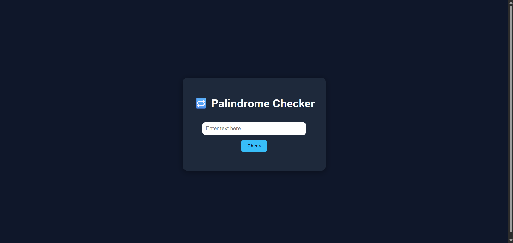
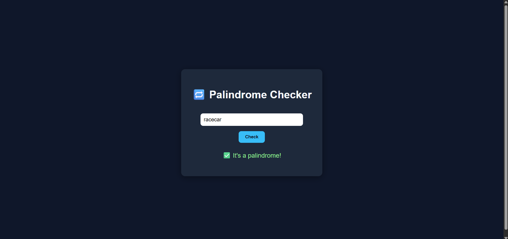
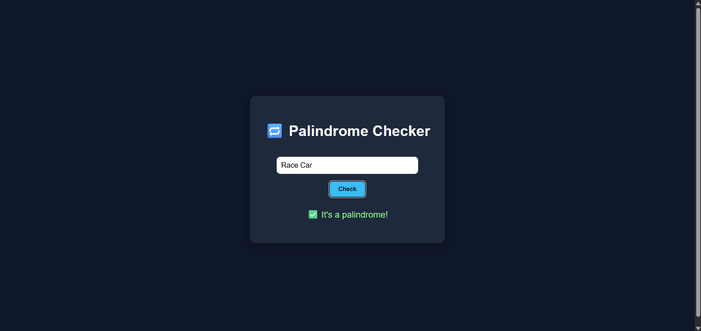
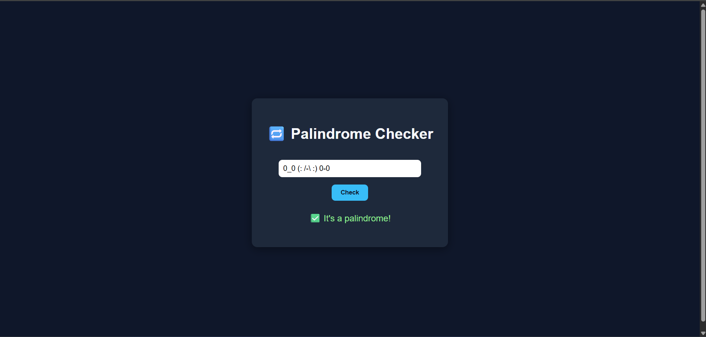

# Palindrome Checker 🌀

A simple web app that checks whether a given word or phrase is a palindrome.  
This app removes non-alphanumeric characters and ignores case sensitivity.

🌐 **Live demo**: [Click here to open](https://xvioz.github.io/palindrome-checker/)

---

## ✨ Features

- ✅ Clean HTML/CSS structure
- ✅ JavaScript logic for detecting palindromes
- ✅ Realtime validation with button click
- ✅ Friendly UI and messages

---

## 📦 Tech Stack

- HTML
- CSS
- JavaScript (Vanilla)

---

## 🚀 How to Use

1. Open the live site.
2. Enter a word or sentence.
3. Click the “Check” button.
4. The result will show if it is a palindrome or not.

---

## 🧠 Example Palindromes

- `racecar`
- `A man, a plan, a canal: Panama`
- `2A3*3a2`

---

## 📁 Project Structure

palindrome-checker/
├── index.html
├── script.js
├── style.css
└── README.md

---

## 🖼️ Preview

---

## 📬 Feedback

Have suggestions or want to contribute?  
Feel free to fork or open an issue!

---

**Created by [Xvioz](https://github.com/Xvioz)** ❤️
